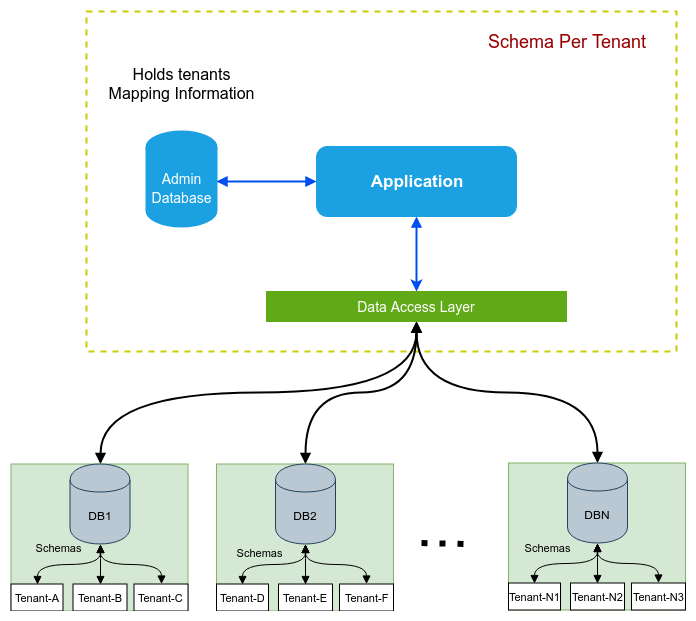

# Multi-tenancy

## O que é Multi-tenancy

Multi-tenancy é uma arquitetura de software na qual uma única instância de software fornece um serviço para vários clientes ou "inquilinos". Um exemplo digno de nota de software multilocatário é o Software como Serviço (SaaS). Um servidor compartilhado por muitos usuários, cada um com seus próprios dados.
# por que usar multi-tenancy?
Um dos principais motivos é que esta arquitetura nos permite dimensionar e atender um grande número de clientes usando recursos de computação compartilhados. 
Outro motivo é que os clientes são atendidos pela mesma pilha de aplicativos. Isso simplifica a implantação geral e a complexidade operacional e reduz os custos associados às operações.

## Formas de implementação do Multi-tenancy – software architecture 

- **Schema compartilhado:** os clientes compartilham um schema comum e são diferenciados por uma coluna discriminadora de cliente .
- **Schemas separados:** os clientes compartilham um banco de dados comum, mas cada cliente possui seu próprio conjunto de tabelas (schema).
- **Bancos de dados separados:** cada clientes possui seu próprio banco de dados.

Neste exemplo será usado a estratégia de implementação baseada em Schemas

## Schema separados:
A abordagem de schema separado por cliente introduz a separação física entre 
clientes enquanto ainda usa o mesmo banco de dados, 
mas cria um novo schema para cada cliente. 
Todas as tabelas pertencentes ao cliente residem nesse schema e os dados do cliente ficam um tanto isolados dos dados de outros clientes

## Implementação

## Tecnologias e frameworks usados
- Java 17
- Maven
- Spring boot 3.1.6
- Hibernate
- JPA
- Postgres 10
- Flyway

---------------------------------------------------------------

Referências: 
- https://github.com/nagaraj-shan-ph/spring-jpa-hibernate-multitenacy-strategies/tree/master
- https://medium.com/@tobias.vargas_/aplica%C3%A7%C3%B5es-multi-tenant-com-spring-boot-e-postgresql-44a5ad8dd6c1